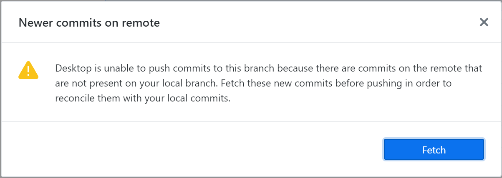
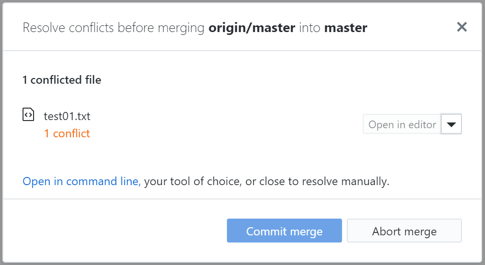
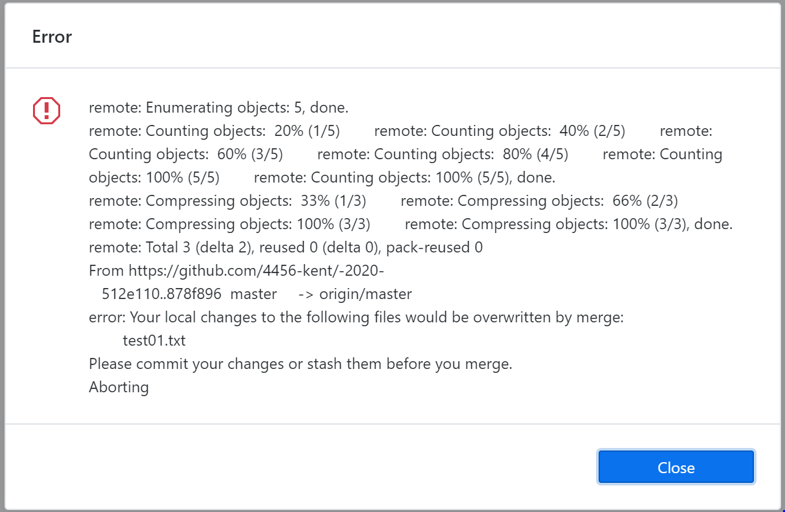

# -2020-
さはらかんB1によるCanSatプロジェクトのファイルバージョン管理
## 手順
1. GitHub Desktpoをインストールする 
  ここから→https://desktop.github.com/  
2. この-2020-のリポジトリをGitHub Desktopでクローンを作成する 
  この際エクスプローラー内にGit管理下のフォルダーが作られる
3. Gitで管理しようと思うファイルを②で作ったフォルダーに入れる
4. コミットする
5. プルしてからプッシュ
## 用語
- リポジトリ
  - ファイルを保存しておく場所
  - リモートリポジトリはGitサーバに配置しているリポジトリ
  - ローカルリポジトリは自分のパソコンに配置するリポジトリ
- 差分(diff)
  - あるファイルとあるファイルの違いのこと
- マージ(merge)
  - 変更を混ぜて取り込むこと
- 競合(conflict)
  - 相反する変更をしようとして、それを反映できない状態のこと
- ブランチ
  - リポジトリ内にある、ファイルの履歴を保存しておく場所。Gitでは必要なだけブランチを作成して、版を切り替えることができる。
- クローン(clone)
  - サーバ上のリポジトリの複製を自分のパソコンに作ること
- ステージングエリア
  - コミット対象のファイルを一時的においておく場所
- コミット
  - ステージングエリアの内容をブランチに反映させること。
- 追跡ブランチ
  - リモートリポジトリを参照しているブランチ
- プッシュ
  - 追跡ブランチを経由して、ローカルリポジトリのブランチをリモートリポジトリに反映させること。要はアップロード。
- プル
  - リモートリポジトリのブランチを追跡ブランチに取り込むフェッチ(fetch)という動作のあとローカルリポジトリに取り込むこと。要はダウンロード
## 注意事項
- ファイルを変更したらコミットすること
  - ただファイルを上書きするだけが変更ではなく、ファイルを削除したりするのもコミット対象になることに注意
- ローカルリポジトリからプッシュする前にプルすること！
  - GitHubの約束事としてリモートリポジトリよりローカルリポジトリの履歴が先に進んでいるときはプッシュできないことになっている。
  - 自分が最後にプルしてからプッシュする間にリモートリポジトリの履歴が変化している(チームメイトが操作)しているはずななのでエラーがでる。
  
- コミットするときは面倒だけどなんかコメント書いて
  - 一応変更箇所なんかは表示されたりするけど、なんで変えたのかとかは書いてほしい。
- 自分とチームメイトが同じファイルで同じ箇所を変更したときプルすると競合(conflict)のエラーがでる。
  - この時はとりあえずマージする。
  - 変更しようとしていたパターンすべてが表示されるので必要な変更の方を残して後は手作業で削除する。
  - 一応slack等で連絡しよう。
  
- 未コミットのファイルが存在するときプルできない現象が起きる可能性がある。
  - 自分が変更を加えてかつコミットしていないファイルが存在している場合、チームメイトが同じファイルをコミット＆プッシュしているとプルできない。
  - 未コミットのファイルがプルのマージ操作によってフォルダの中にあるファイルが上書きされてしまうのを防ぐためである。
  - エラーが出た場合、closeをクリックして、その後未コミットのファイルをコミットするか変更を削除するとプルすることができる。
  
- 未コミットのファイルがあってかつどうしてもプルしたい時はブランチを生やす。
  - 状況の具体例として、ファイルの変更がまだ途中で、コミット＆プッシュしてしまうと中途半端な状態でリモートリポジトリに影響を与えてしまう時など。
  - ブランチとは木の枝のように履歴を枝分かれさせる機能のこと。
  - 通常のブランチはmasterになっているが、例えば”ブランチA”というブランチを生やした場合、ブランチAで未コミットのファイルをコミットしてもmasterには反映されない。
  - 手順としては、①ブランチを生やす→②未コミット(作業途中のファイル)をコミット→③ブランチをmasterに切り替える→④プルする→⑤生やしたブランチに切り替え→⑥masterブランチを生やしたブランチにマージする
  - 生やしたブランチにリモートリポジトリの更新を反映させたい場合、面倒だが③から⑤の手順を繰り返す。
  - 作業がひと段落ついたときは逆に生やしたブランチをmasterにマージして、その後コミット＆プッシュすることでリモートリポジトリに反映させる。
